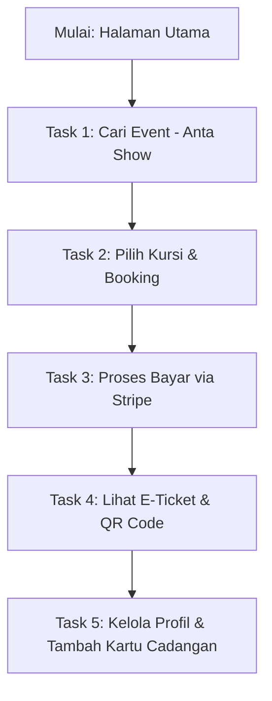

# Laporan Hasil Usability Testing & Validasi Prosedur Testing
**Aplikasi: EventEase (Stitch + Neon Event Seat Booking)**  
**Tester: Antigravity AI Agent**  
**Tanggal Pengujian: 7 Mei 2026**  
**Akun Uji: suddensae@gmail.com / 12345678**

---

## 📊 Bagian 1: Hasil Eksekusi Prosedur Testing (Task 1 - Task 5)

Berikut adalah laporan eksekusi langkah-demi-langkah yang dilakukan secara otomatis oleh AI Agent pada server lokal (`http://localhost:3000`):

### Task 1: Memperbarui Profil Pengguna
* **Status**: **Berhasil** (Dengan Catatan UX)
* **Langkah yang Dilakukan**:
  1. Login ke aplikasi menggunakan akun `suddensae@gmail.com`.
  2. Membuka halaman profil (`/profile`) lalu memilih tab **PROFILE DETAILS** di menu kiri.
  3. Mengubah data:
     * **First Name**: `Ridho Update`
     * **Last Name**: `Rizqullah Update`
     * **Phone Number**: `08123456789`
     * **Physical Address**: `Bandung, Indonesia`
  4. Menekan tombol **SAVE CHANGES**.
* **Hasil Akhir**: Data berhasil tersimpan. Nama pada sidebar langsung berubah menjadi **"Ridho Update Rizqullah Update"**.
* **Temuan/Discrepancy**:
  > [!WARNING]
  > Pada deskripsi Use Case Task 1, tertulis *"Tester mengubah data diri seperti nama atau email."* Namun, pada aplikasi, kolom **Email Address bersifat read-only (disabled)** dan tidak dapat diubah demi keamanan akun.

---

### Task 2: Menambahkan Metode Pembayaran Baru
* **Status**: **Berhasil** (Fitur Mock Berfungsi Baik)
* **Langkah yang Dilakukan**:
  1. Berada di halaman profil, lalu memilih tab **PAYMENTS** di menu kiri.
  2. Menemukan formulir **Payment Methods** (mock Stripe).
  3. Mengisi informasi kartu uji standar Stripe:
     * **Cardholder Name**: `Ridho Update Rizqullah Update`
     * **Card Number**: `4242 4242 4242 4242`
     * **Expiry (MM/YY)**: `12/28`
     * **CVV**: `123`
  4. Menekan tombol **SAVE CARD**.
* **Hasil Akhir**: Kartu berhasil tersimpan ke dalam database profil pengguna.

---

### Task 3: Mencari Event "Anta Show"
* **Status**: **Berhasil**
* **Langkah yang Dilakukan**:
  1. Kembali ke halaman utama (`/`).
  2. Mengklik fitur **Search Bar** di bagian atas dengan placeholder *"Search events..."*.
  3. Mengetik kata kunci **"Anta Show"** lalu melakukan pencarian.
  4. Memilih event **"Anta Show: Night of Music & Performance"** yang muncul di hasil pencarian.
* **Hasil Akhir**: Halaman detail event berhasil dimuat dengan URL `/events/34acb4fa-06f0-4640-8d01-2844558e4022`.

---

### Task 4: Memilih Kursi dan Memesan Tiket
* **Status**: **Berhasil** (Integrasi Stripe Sandbox Sangat Mulus)
* **Langkah yang Dilakukan**:
  1. Di halaman detail event, mengklik tombol **Select Seats**.
  2. Pada peta kursi, memilih kursi **A3** (default kategori tiket: **Adult / Dewasa** seharga £27.50).
  3. Mengklik tombol **Checkout** untuk menuju ke halaman konfirmasi pemesanan.
  4. Mengisi informasi kontak tambahan di halaman checkout:
     * **Full Name**: `Suddensae`
     * **Phone Number**: `081234567890`
  5. Menekan tombol **Bayar Sekarang** yang mengalihkan ke portal Stripe Sandbox asli.
  6. Di halaman Stripe, mengklik **"Pay without Link"** untuk melewati verifikasi nomor telepon.
  7. Memasukkan kartu kredit uji Stripe (`4242 4242 4242 4242`, exp `12/28`, cvc `123`) lalu menekan **Pay**.
* **Hasil Akhir**: Pembayaran diproses dan sistem secara otomatis mengalihkan kembali ke halaman sukses dengan informasi tiket lengkap, lalu masuk ke daftar **My Tickets**.

---

### Task 5: Melihat Detail Tiket yang Dipesan
* **Status**: **Berhasil**
* **Langkah yang Dilakukan**:
  1. Diarahkan otomatis ke halaman **My Tickets** (`/tickets`).
  2. Menemukan tiket aktif untuk **"Anta Show: Night of Music & Performance"**.
  3. Mengklik tombol **VIEW DETAILS** untuk melihat struk pembayaran dan detail transaksi lengkap.
* **Hasil Akhir**: Semua informasi tiket ditampilkan dengan sangat lengkap:
  * **Booking ID**: `BK926323HHU`
  * **Status**: `CONFIRMED` (Hijau)
  * **Jadwal**: Rabu, 6 Mei 2026 pukul 21.13 WIB
  * **Lokasi**: Demo Theatre, Hall A / Main Hall
  * **Kursi**: 1 Kursi Cadangan (A3)
  * **Metode**: Stripe Card Payment
  * **QR Code**: Aktif dan siap dipindai (*Entry Pass - Scan at entrance*)

---

## 🔍 Bagian 2: Validasi & Analisis Kritis Urutan Task (Untuk Tester Riil)

Berdasarkan hasil pengujian di atas, terdapat beberapa temuan penting yang membuat urutan task saat ini **kurang efisien** dan **potensial membingungkan** bagi tester manusia (riil). Berikut analisisnya:

### 1. Masalah Redundansi Data & Alur yang Tidak Nyambung
* **Fakta Lapangan**: Di **Task 1** & **Task 2**, tester diminta mengisi profil (Nama & Telepon) dan menambahkan kartu pembayaran di halaman profil. Namun, ketika tester melakukan checkout di **Task 4**, aplikasi **tetap meminta tester mengisi Nama & Telepon lagi secara manual**, serta **meminta kartu kredit lagi di form Stripe**.
* **Dampak**: Tester riil akan merasa aneh: *"Kenapa saya harus isi nama, telepon, dan kartu dua kali?"*

### 2. Inkonsistensi Instruksi Task 1
* **Fakta Lapangan**: Task 1 meminta mengubah **email**. Namun di UI, kolom email **dikunci (disabled)**.
* **Dampak**: Tester riil akan kebingungan mencari cara mengedit kolom email dan bisa menganggap aplikasi error/bug.

### 3. Solusi Stripe Link Pop-up (Task 4)
* **Fakta Lapangan**: Stripe Checkout default sering kali memunculkan "Stripe Link" yang meminta OTP telepon seluler.
* **Dampak**: Tester riil bisa panik karena mengira mereka harus memasukkan nomor HP asli mereka untuk menerima SMS OTP.

---

## 🛠️ Bagian 3: Rekomendasi Struktur Task yang Baru (Lebih Natural & Efisien)

Untuk memudahkan pengujian usability testing oleh tester riil, kami menyarankan **re-order urutan task** agar mengikuti pola perilaku pengguna yang alami (*User Journey*):

### 📋 Skenario Baru yang Direkomendasikan untuk Tester:

* **Task 1 (Eksplorasi & Pencarian)**: *"Anda ingin menonton pertunjukan musik di akhir pekan. Cari event bernama 'Anta Show' menggunakan fitur pencarian di halaman utama, lalu buka halaman detailnya."*
* **Task 2 (Pemilihan Kursi & Checkout)**: *"Pilih kursi favorit Anda (misal baris depan A3) dan lakukan pemesanan. Masukkan detail kontak Anda untuk tiket tersebut."*
* **Task 3 (Pembayaran)**: *"Selesaikan pembayaran tiket Anda menggunakan metode kartu kredit uji yang disediakan (Gunakan kartu 4242...)."*
  > *Catatan untuk Tester: Jika muncul pop-up Stripe Link, klik "Pay without Link" atau "Bayar tanpa Link" agar langsung masuk ke form kartu.*
* **Task 4 (Verifikasi Tiket)**: *"Pastikan tiket Anda sudah berhasil dipesan dengan membuka menu 'My Tickets', lalu periksa apakah statusnya 'CONFIRMED' dan memiliki QR Code masuk."*
* **Task 5 (Manajemen Profil & Metode Pembayaran Cadangan)**: *"Sekarang, perbarui profil Anda dengan nomor telepon terbaru dan simpan kartu pembayaran cadangan Anda di menu profil untuk transaksi mendatang."*

---

## 📝 Lembar Panduan Instruksi Tester (Siap Cetak / Bagikan)

Gunakan panduan ringkas berikut saat menguji ke tester riil agar mereka tidak mengalami hambatan teknis:

| No | Langkah/Task | Data Input yang Wajib Digunakan | Ekspektasi Hasil |
|---|---|---|---|
| **0** | **Login Akun** | Email: `suddensae@gmail.com` Password: `12345678` | Berhasil masuk ke dashboard utama. |
| **1** | **Cari Event** | Kata Kunci: `"Anta Show"` | Menemukan event dan masuk ke detail event. |
| **2** | **Pesan Kursi** | Pilih salah satu kursi yang berwarna putih (tersedia), contoh: `A3`. | Tombol Checkout aktif dan menampilkan ringkasan harga. |
| **3** | **Checkout & Bayar** | Nama: Nama Tester No. HP: Bebas (misal `0812...`) | Dialihkan ke halaman Stripe. |
| **4** | **Stripe Sandbox** | No. Kartu: `4242 4242 4242 4242` Exp: `12/28`, CVV: `123` | Pembayaran sukses, otomatis kembali ke aplikasi. |
| **5** | **Lihat Tiket** | Klik **VIEW DETAILS** pada tiket. | Tiket berstatus `CONFIRMED` dengan kode QR aktif. |
| **6** | **Update Profil** | Ubah Nama, No. HP, dan Alamat di tab **Profile Details**. *(Catatan: Email tidak bisa diubah)* | Nama di sidebar langsung ter-update secara real-time. |
